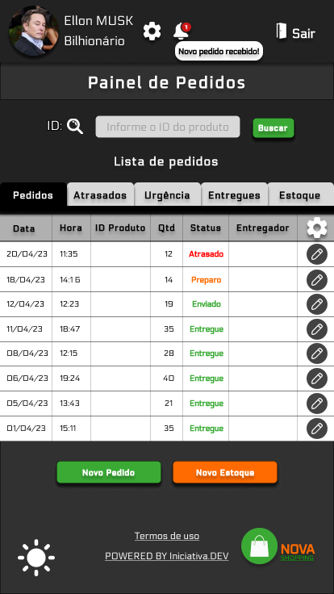
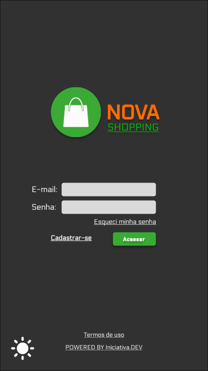
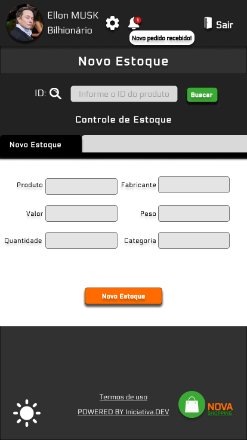

# Front-End -- Sistema de cadastro e entregas (NOVA SHOPPING)

Em construção .............

## Projeto 2 - Equipe 4

<table><tr><td valign="top" width="33%">

###  [João Paulo](https://github.com/JoaoPauloPereirax)

  
 

</td><td valign="top" width="33%">

### [Carol Toledo](https://github.com/Carol-Sust) 

  
 

</td><td valign="top" width="33%">

### [Filipe H. Secherini](https://github.com/Sechebr)

  
 

</td></tr></table>  

## Tecnologias utilizadas

  
    
 
  

## Templates

### Modelo de Login ADM 

http://localhost:3000

### Modelo de Folha de Registros

http://localhost:3000/registers

### Modelo de Novo Estoque

http://localhost:3000/newstorage

=======
### Modelo de Login ADM

### Modelo de Folha de Registros

### Modelo de Novo Estoque

## Modo de usar

### Git Bash (SSH)

     $ git clone git@github.com:iniciativa-dev/nova-shopping-react-app.git

### Terminal (Dentro da pasta)

     $ npm install

### Rodando em um servidor local (http://localhost:3000)

     $ npm start
